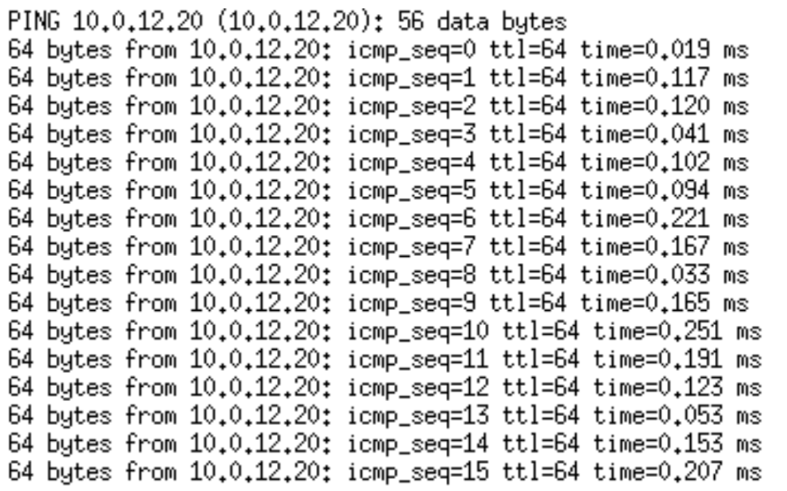
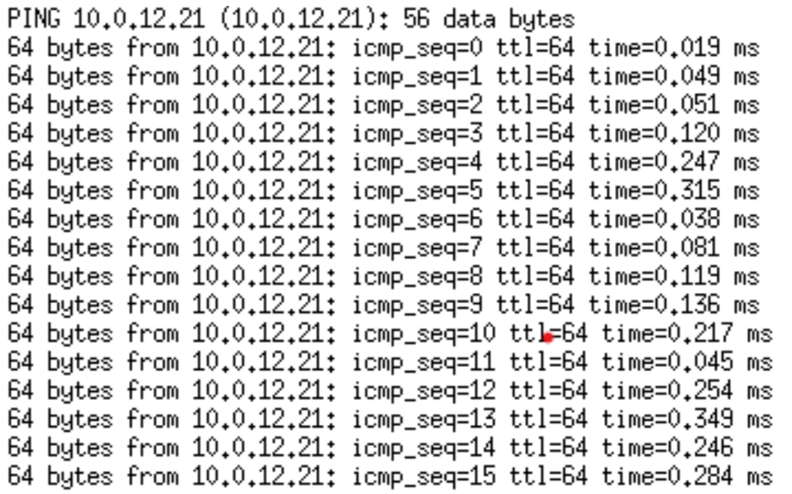
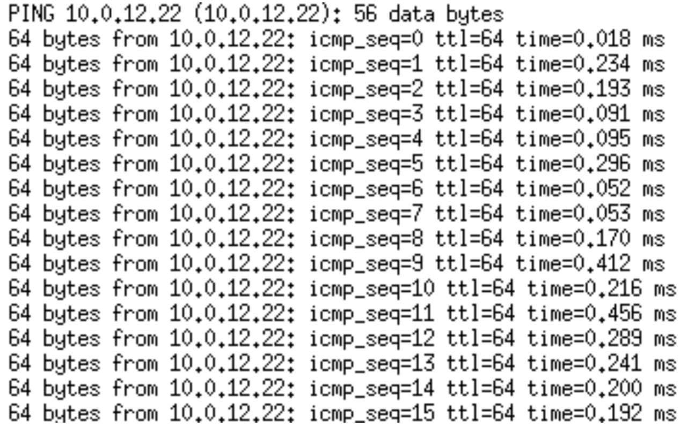
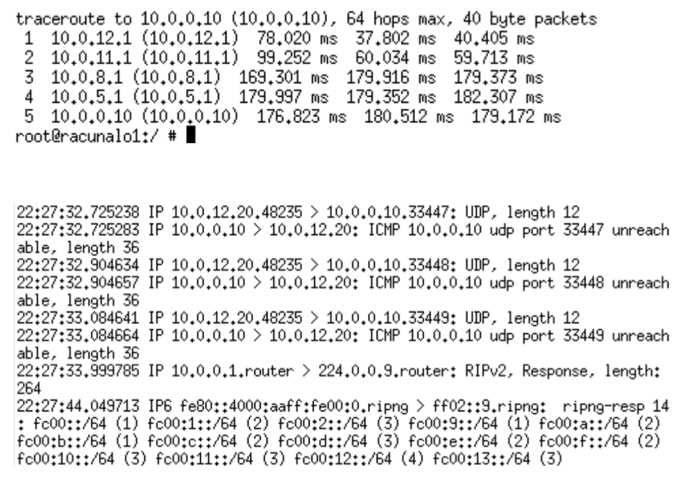

# Mreže računala - LAB2 izvještaj

Hrvoje Kajba - IPS-G2

---

## Zadaci

### 1.

### 2.

Prosječna latencija za prvog poslužitelja je 0.13ms, za drugog 0.16ms te za trećeg 0.20ms. Prilikom korištenja naredbe `ping` koristi se RIP (Routing Information Protocol).

### 3.

Paketi računala ne prolaze tim usmjernikom, to znamo po tome da IP adresa računala nije vidljiva.

### 4.

Veza sa usmjernikom je uspostavljena putem koji je išao od računala 1 do preklopnika, pa od preklopnika do računala 2. Nakon toga je išao kroz usmjernika 1, usmjernika 5, usmjernika 6 pa konačno do poslužitelja 1.

Put kojim je išao `traceroute` sam otkrio preko IP adresa koje je on ispisao. Dva protokola koja se najčešće pojavljuju u komunikaciji između računala i usmjernika su UDP i ICMP. Podaci u paketima koje šalje računalo imaju 12 bajtova i prazni su. Računala koriste UDP protokol, dok usmjernici odgovaraju sa ICMP.

### 5.

Prosječno vrijeme odgovora poslužitelja kada su ugašeni netcati na sva tri računala iznosi 191,82ms.
