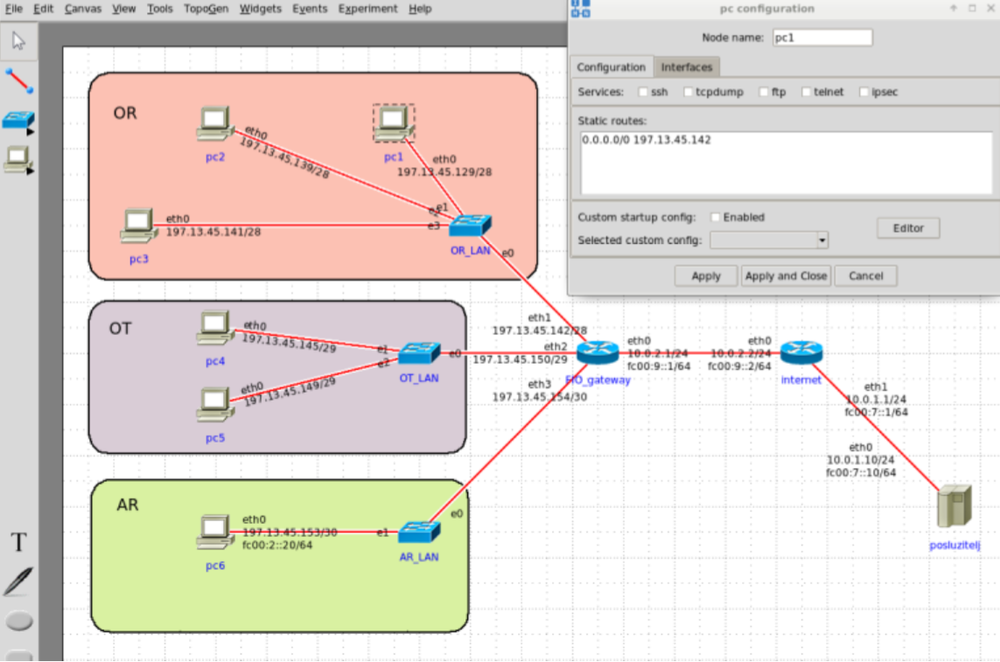

# Mreže računala - LAB7 izvještaj

Hrvoje Kajba - IPS-G2

---

## Topologija

---

## Zadaci

### 1.

**Koliko je ukupno IP adresa prodano poduzeću FIO d.o.o.?**

Prodano je 28 IP adresa.

### 2.

**Koliko je tih adresa iskoristivo (alocirano nekom čvoru)?**

Iskoristive su 22 IP adrese.

### 3a

**Koliko IP adresa je potrebno alocirati svakom odjelu?**

Za OR je potrebno alocirati 16 IP adresa, za OT 8 IP adresa, a za AR 4 IP adrese.

### 3b

**Koje su mrežne adrese podmreža odjela?**

Mrežne adresa za OR je `197.13.45.142/28`, za OT je `197.13.45.150/29` te je za AR `197.13.45.154/30`.

### 3c

**Koje su sve odredišne (broadcast) adrese podmreža odjela?**

Odredišne adresa za OR je `197.13.45.128/28`, za OT je `197.13.45.144/29` i za AR je `197.13.45.152/30`.

### 3d

**Koje su vrijednosti maski podmreža odjela?**

Vrijednosti maski podmreža odjela su redom: OR je `255.255.255.240`, OT je `255.255.255.248` i AR je `255.255.255.252`.

### 3e

**Koje su prve i zadnje iskoristive adrese podmreža odjela? Zapisati u CIDR notaciji.**

Prva iskoristiva adresa kod OR je `197.13.45.129/28`, kod OT je `197.13.45.145/29` i kod AR je `197.13.45.153/30`. Zadnja iskoristiva adresa kod OR je `197.13.45.142/28`, kod OT je `197.13.45.150/29` i kod AR je `197.13.45.154/30`.

### 3f

**Koje su adrese unutarnjih mrežnih sučelja FIO gatewaya? Zapisati u CIDR notaciji.**

Adrese unutarnjih mrežnih sučelja FIO gatewaya je za OR `197.13.45.142/28`, za OT `197.13.45.150/29` i za AR je `197.13.45.154/30`.

### 3g

**Koliko je, u odnosu na potrebe prikazane u zadatku, ostalo neiskorištenih adresa unutar svake podmreže odjela? Komentirajte zašto.**

Ostale su po dvije neiskorištene adrese za svaki odjel koji je prikazan, dakle sve skupa to je šest neiskorištenih adresa.

---

## Diskusija

### 1.

**Je li uspjelo pokretanje simulacije bez poruka o pogreškama?**

Pokretanje simulacije se izvelo uz upozorenja pri pokretanju.

### 2.

**Ako na usmjerniku pod nazivom „Internet“ pokrenete tcp dump (uključite tu uslugu prije pokretanja simulacije) te na računalu iz OR LAN-a uspostavite ssh vezu sa vanjskim poslužiteljem koje adrese i portove uočavate u tcpdump ispisu?**

Uočavam portove: 911228, 493043, 882372, 477614, 460677.
