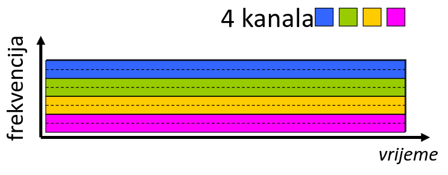
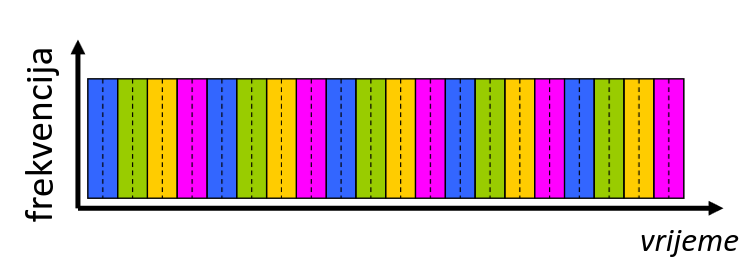

# Mreže računala - provjera 1
## Uvod 1.
### 1.1. Internet
**Internet** - mreža mnogo mreža

Infrastruktura koja pruža usluge aplikacijama: *web, strujanje pohranjenog videa, videokonferencija, e-pošta, igre, socijalne mreže...*

Pruža programsko sučelje za distribuirane aplikacije: *sredstva koja omogućuju aplikacijama da šalju i primaju podatke koji se prenose Internetom, pružaju opcije usluga analogno poštanskoj usluzi.*

**Protokoli** određuju *format i redoslijed poruka* koje se *šalju i primaju* te *akcije koje se poduzimaju* prilikom slanja i primanja poruka. Ukratko, protokoli kontroliraju slanje i primanje poruka.Neki od najpoznatijih protokola su *HTTP, UDP, TCP i Ethernet*.

**Doseg mreže** se odnosi sa duljinu poveznica, odnosno na udaljenost između mrežnih uređaja. Postoje dvije najpoznatije vrste: *LAN* (local area network) i *WAN* (wide area network).

S obzirom na doseg se koriste različite tehnologije i protokoli.

### 1.2. Rub i jezgra mreže
**Rub mreže** se sastoji od domaćina (*hosts*); klijenta i poslužitelja.

**Pristupne mreže i fizički mediji** se sastoje od žičanih i bežičnih komunikacijskih poveznica. Ako je u pitanje žičana poveznica onda se zove vod.

**Jezgra mreže** se sastoji od povezanih usmjernika i mreža drugih mreža. Jedan primjer jezgre mreže je ISP.

Neki od najčešćih žičanih komunikacijskih poveznica su: *optičko vlakno, DSL (digital subscriber line), koaksijalni kabel, upletene parice (TP).*

Neki od najčešćih bežičnih komunikacijskih poveznica su: *WLAN (WiFi), mobilne mreže, satelitske pristupne mreže, Bluetooth.*

Također postoje i pristupne mreže (mreže podatkovnih centara) koje su brze poveznice koje povezuju stotine ili tisuće poslužitelja zajedno i na Internet.

Računalo šalje pakete podataka. To radi tako da svaku poruku razdjeli na više paketa dugih L bitova, te ih prenosi brzinom prijenosa paketa R. Ovime možemo izračunati trajanje prijenosa, tj. vrijeme potrebno za prijenos L-bitnih paketa na poveznicu.

### 1.3. Prespajanje paketa i vodova

Glavna uloga jezgre mreže je *prespajanje paketa*. Računala dijele poruke na pakete, a mreža prespaja te pakete od usmjernika do usmjernika kroz poveznice na putu od izvora do odredišta. Svaki paket se šalje punim kapacitetom kanala.

Dvije osnovne funkcije jezgre mreže su:

- **prosljeđivanje (forwarding)**
- **usmjeravanje (routing)**

**Prosljeđivanje** je lokalna akcija: premještanje paketa s ulaza usmjernika na odgovarajući izlaz.

**Usmjeravanje** je globalna akcija: određivanje cijelog puta kojim će putovati paketi do odredišta. Postoje algoritmi usmjeravanja mojim se taj put određuje.

Prilikom prespajanja paketa cijeli paket mora stići u usmjernik prije nego što se smije prosljediti dalje (pohrani-pa-prosljedi).

Prilikom prespajanja paketa također može doći do čekanja u redu kada zadaci dolaze brže nego što se mogu izvršiti. Do ovoga dolazi ako je brzina dolaska (b/s) na poveznicu veća od kapaciteta kanala (b/s) u određenom vremenu. Paket se također može odbaciti ako je međuspremnik usmjernika do kraja popunjen.

Prilikom prespajanja paketa su rezervirana sredstva od-kraja-do-kraja (rezervirani vodovi od ishodišta paketa do njegovog odredišta). Kada su sredstva rezervirana ne mogu se dijeliti, što garantira performanse mreže. Ako rezervirani segment vodova neiskorišten od strane vlasnika, nitko drugi ga ne smije koristiti (nema dijeljenja). Ovaj način rada se obično koristi u tradicionalnim telefonskim igrama.

Postoje dva glavna načina prespajanja vodova:

1. **FDM** (Frequency Division Multiplexing) 
2. **TDM** (Time Division Multiplexing) 

U FDM-u optičke ili elektromagnetske frekvencije su podjeljene u manje frekvencijske pojaseve. Svaki poziv dobiva svoj frekvencijski pojas; može cijelo vrijeme prenositi podatke maksimalnom brzinom tog manjeg pojasa.

U TDM-u je samo vrijeme u kojem je vodič dostupan podijeljeno u odsječke. Svaki poziv dobiva odsječak periodički; može slati maksimalnom brzinom (većeg) frekvencijskog pojasa (samo) za vrijeme svojih vremenskih odsječaka.

### 1.4. Struktura interneta
Internet je sama mreža svih mreža. Domaćini se povezuju na Internet preko pristupnih davatelja internetskih usluga (ISP). Pristupni ISP-ovi moraju biti međusobno povezani tako da bilo koja dva domaćina mogu međusobno slati pakete, neovisno o tome gdje se nalaze. Rezultirajuća mreža je izuzetno kompleksna, na njen razvoj su utjecala ekonomija i nacionalne politike.

Postoje dvije glavne razine Interneta, to su prva razina (*tier one*) koja se sastoji od komercijalnih ISP-ova (Level 3, Sprint AT&T...) koji osiguravaju nacionalnu i međunarodnu pokrivenost te i mreže za distribuciju sadržaja (Google...) koja je privatna mreža koja povezuje podatkovne centre na Internetu, često zaobilazeći ISP-ove prve razine i regionalne ISP-ove.

### 1.5. Performanse
