# Druga seminarska zadaća iz Mreža računala - DNS
## Hrvoje Kajba - IPS2-S-G13

---

### Pitanje 1.

**Pitanje:**
Pomoću nslookup saznajte IP adresu (verzije 4) web poslužitelja Nanyang tehnološkog sveučilišta iz Singapura. Naziv tog web-poslužitelja je www.ntu.edu.sg.

**Odgovor:**
`nslookup` za www.ntu.edu.sg vraća 192.168.8.1 kao IP računala na toj adresi. IP poslužitelja je 104.16.4.14.

---

### Pitanje 2.

**Pitanje:**
Pomoću nslookup odredite naziv autoritativnog poslužitelja DNS-a za domenu uu.se koja pripada Sveučilištu Uppsala iz Švedske.

**Odgovor:**
`nslookup` za uu.se kao autoritativne poslužitelje DNS-a vraća:

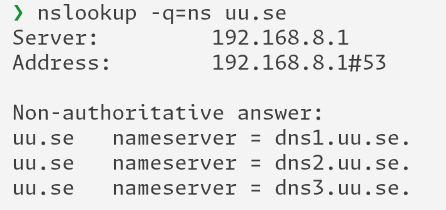

---

### Pitanje 3.

**Pitanje:**
Pokrenite nslookup naredbu kojom ćete saznati naziv poslužitelja e-pošte Indijskog instituta za tehnologiju iz Mumbaija, ako je primjer jedne e-mail adrese dean.ap@iitb.ac.in, ali tako da upit ne šaljete svom lokalnom DNS poslužitelju nego poslužitelju 8.8.8.8

**Odgovor:**
`nslookup` nije mogao pronaći poslužitelja za DNS

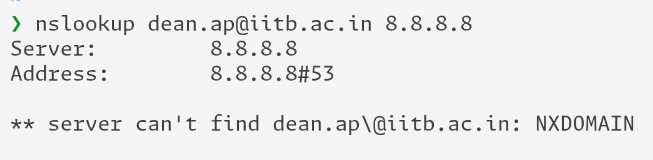

---

### Pitanje 4.

**Pitanje:**
Pronađite poruke upita i odgovora DNS-a (eng. DNS query; DNS response). Šalju li se preko protokola UDP ili TCP?

**Odgovor:**
Poruke upita i odgovora DNS-a se šalju preko TCP.

---

### Pitanje 5.

**Pitanje:**
Koji je odredišni port poruke upita DNS-a? Koji je izvorišni port poruke odgovora DNS-a?

**Odgovor:**
Odredišni port poruke upita DNS-a je 53, a izvornišni port poruke odgovora DNS-a je također 53.

---

### Pitanje 6.

**Pitanje:**
Na koju adresu IP je poslana poruka upita DNS-a? Pomoću ipconfig odredite adresu IP vašeg lokalnog poslužitelja DNS-a. Jesu li te dvije adrese IP jednake?

**Odgovor:**
Poruka upita DNS-a je poslana na IP adresu 192.168.8.1, IP adresa lokalnog poslužitelja DNS je također 192.168.8.1.

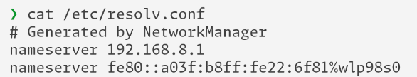
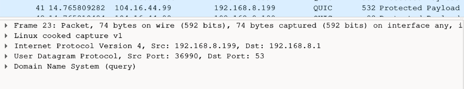

---

### Pitanje 7.

**Pitanje:**
Analizirajte poruku upita DNS-a. Koji je „tip“ (eng. „type”) upita DNS-a? Sadrži li poruka upita bilo kakav „odgovor“?

**Odgovor:**
Tip poruke upita DNS-a je HTTPS, poruka ne sadrži bilo kakav odgovor.

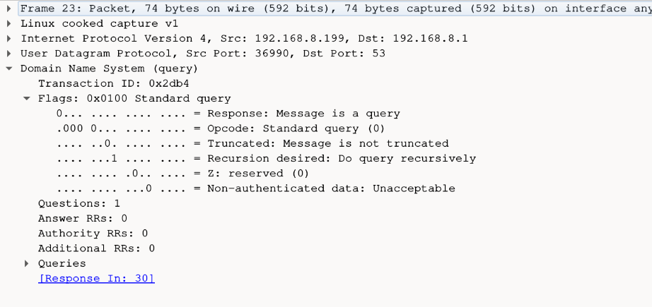

---

### Pitanje 8.

**Pitanje:**
Analizirajte poruku odgovora DNS-a. Koliko „odgovora“ je navedeno? Što svaki od tih odgovora sadrži?

**Odgovor:**
Poruka odgovora DNS-a sadrži jedan odgovor. Odgovor sadrži ime odgovora, njegov tip, klasu, TTL i duljinu poruke.

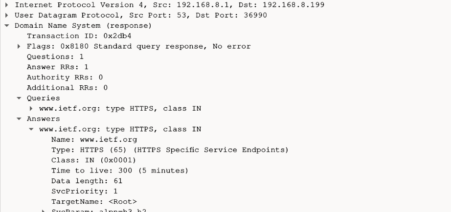

---

### Pitanje 9.

**Pitanje:**
Pogledajte paket TCP SYN koje je poslalo vaše računalo i koje se treba nalaziti neposredno iza odgovora DNS-a. (Napomena. Ako ste za vrijeme snimanja mrežnog prometa imali neke aplikacije aktivne, moguće je da se između nalaze i neki drugi paketi, koji nisu vezani za ovu vježbu!) Odgovara li IP adresa paketa TCP SYN nekoj od IP adresa koje ste dobili u odgovoru DNS-a?

**Odgovor:**
Pri pregledu vidljivo je da je IP adresa ishodišta TCP SYN paketa jednaka IP adresi odredišta poruke odogovora DNS-a.

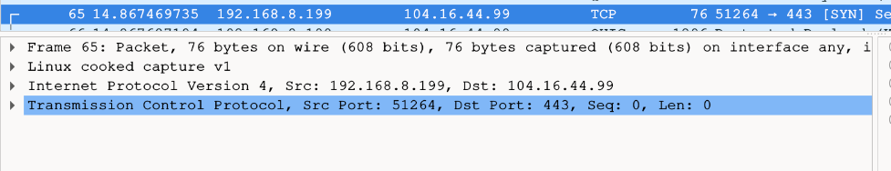

---

### Pitanje 10.

**Pitanje:**
Ova web stranica sadrži slike. Šalje li vaše računalo nove upite DNS-u prije dohvaćanja svake slike

**Odgovor:**
Računalo ne šalje poseban DNS upit za svaku sliku, već dohvaća sve slike odjednom.

---

### Pitanje 11.

**Pitanje:**
Koji je odredišni port poruke upita DNS-a? Koji je izvorišni port poruke odgovora DNS-a

**Odgovor:**
Odredišni port poruke upita DNS-a je 53, a izvornišni port poruke odgovora DNS-a je također 53.

---

### Pitanje 12.

**Pitanje:**
Na koju adresu IP je poslana poruka upita DNS-a? Je li to IP adresa vašeg lokalnog poslužitelja DNS-a?

**Odgovor:**
Poruka upita DNS-a je poslana na 192.168.8.1, to uistinu je IP adresa mojeg lokalnog poslužitelja DNS-a.

---

### Pitanje 13.

**Pitanje:**
Analizirajte poruku upita DNS-a. Koji je „tip“ (eng. „type”) upita DNS-a? Sadrži li poruka upita bilo kakav „odgovor“?

**Odgovor:**
Tip upita DNS-a je A, poruka ne sadrži nikakav odgovor.

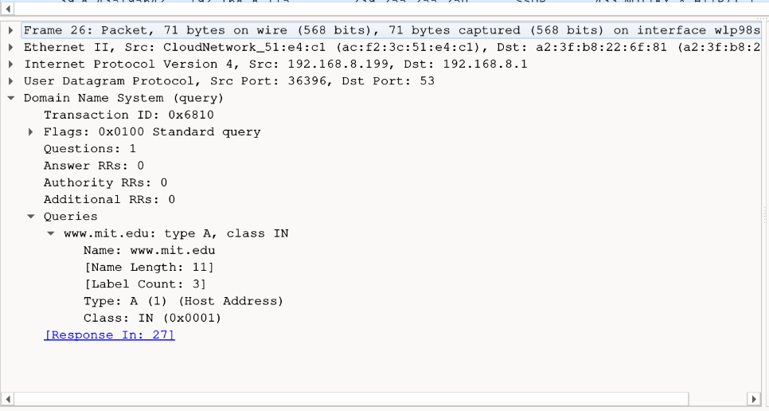

---

### Pitanje 14.

**Pitanje:**
Analizirajte poruku odgovora DNS-a. Koliko „odgovora“ je navedeno? Što svaki od tih odgovora sadrži?

**Odgovor:**
Poruka odgovora sadrži tri odgovora unutar sebe, svaki od tih odgovora sadrži Name, Type, Class, TTL, Data length i CNAME.

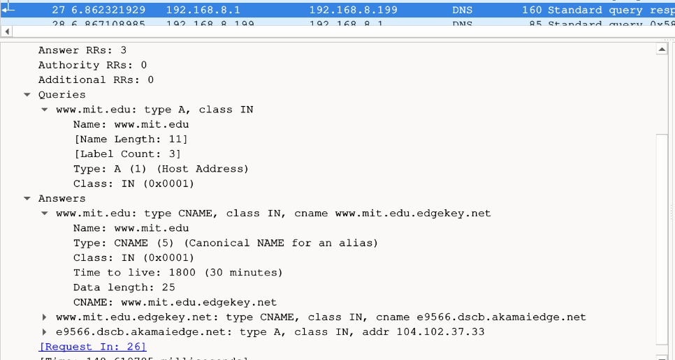

---

### Pitanje 15.

**Pitanje:**
Na koju adresu IP je poslana poruka upita DNS-a? Je li to IP adresa vašeg lokalnog poslužitelja DNS-a?

**Odgovor:**
Poruka upita DNS-a je poslana na 192.168.8.1 što je IP adresa mog lokalnog poslužitelja DNS-a.

---

### Pitanje 16.

**Pitanje:**
Analizirajte poruku upita DNS-a. Koji je „tip“ (eng. „type”) upita DNS-a? Sadrži li poruka upita bilo kakav „odgovor“?

**Odgovor:**
Poruka upita DNS-a je tipa NS, ne sadrži bilo kakav odgovor.

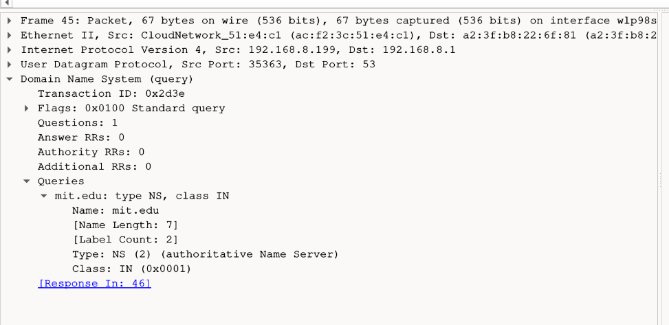

---

### Pitanje 17.

**Pitanje:**
Analizirajte poruku odgovora DNS-a. Koji su MIT-jevi imenički poslužitelji navedeni u poruci odgovora?Sadrži li ta poruka odgovora i IP adrese navedenih MIT-jevih imeničkih poslužitelja?

**Odgovor:**
MIT-jevi imenički poslužitelji koji su navedeni u poruci odgovora su vidljivi na slici ispod, poruka ne sadrži njihove IP adrese.

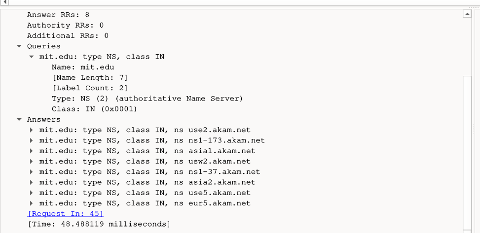

---

### Pitanje 18.

**Pitanje:**
Na koje su IP adrese poslane poruke DNS upita? Jesu li to IP adrese vašeg lokalnog poslužitelja DNS? Ako nisu, čije su to IP adrese?

**Odgovor:**
Poruke upita DNS-a su poslane na IP adresu 1.1.1.1, to nije IP adresa mog lokalnog poslužitelja. Adresa 1.1.1.1 odgovara IP adresi Cloudflare-ovog besplatnog DNS poslužitelja.

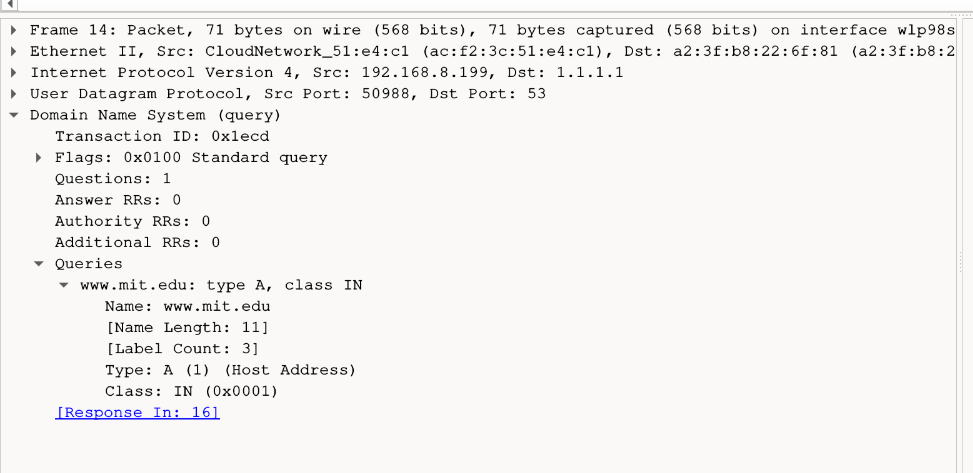

---

### Pitanje 19.

**Pitanje:**
Analizirajte poruku upita DNS-a. Koji je „tip“ (eng. „type”) upita DNS-a? Sadrži li poruka upita bilo kakav „odgovor“?

**Odgovor:**
Poruka upita DNS-a je tipa A, kao što je vidljivo na gornjoj slici, ne sadrži nikakav odgovor.

---

### Pitanje 20.

**Pitanje:**
Analizirajte poruku odgovora DNS-a. Koliko „odgovora“ je navedeno? Što svaki od tih odgovora sadrži?

**Odgovor:**
Poruka odgovora sadrži tri odgovora unutar sebe, svaki od tih odgovora sadrži Name, Type, Class, TTL, Data length i CNAME.

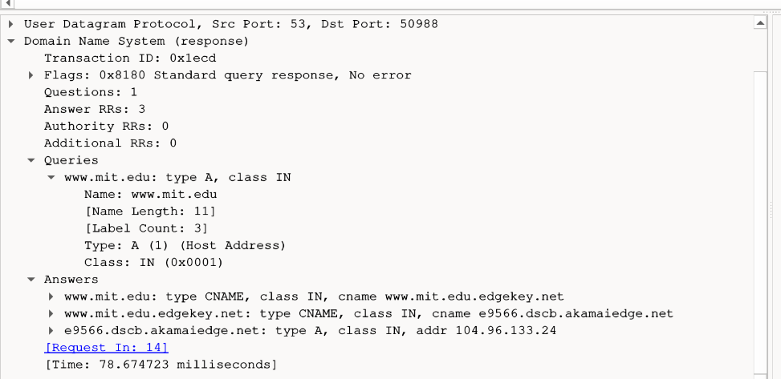

---

### Pitanje 21.

**Pitanje:**
Kako se zove poslužitelj e-pošte za foi.hr domenu? (Postoji li jedan ili više poslužitelja e-pošte za foi.hr?)

**Odgovor:**
Postoji više poslužitelja e-pošte za foi.hr domenu, no svi dolaze od Google-a.

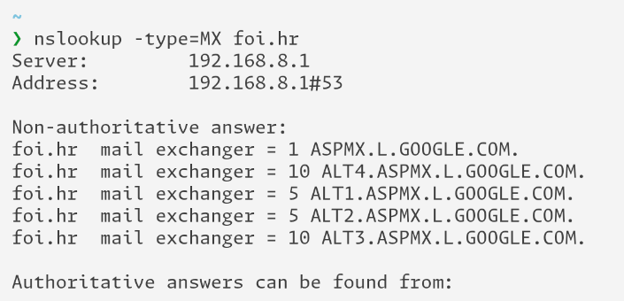

---

### Pitanje 22.

**Pitanje:**
U Wiresharku pronađite poruku DNS-odgovora u kojem je navedeno ime poslužitelja e-pošte s najmanjom vrijednosti polja “Preference”. Što je zapisano u polju “Name”? Koja je vrijednost zapisana u polju “Time to live” i što ona označava? Kako se zove polje u kojem je navedeno ime poslužitelja e-pošte?

**Odgovor:**
Unutar odgovora s najmanjom vrijednosti polja "Preference" kao Name piše foi.hr. Unutar polja "Time to live" je vrijednost 289, a ta vrijednost označava koliko dugo DNS zapis smije ostati u cache-u prije nego li se mora ponovno dohvatiti. Naziv polja u kojem je naveden poslužitelj e-pošte je "Mail Exchange".

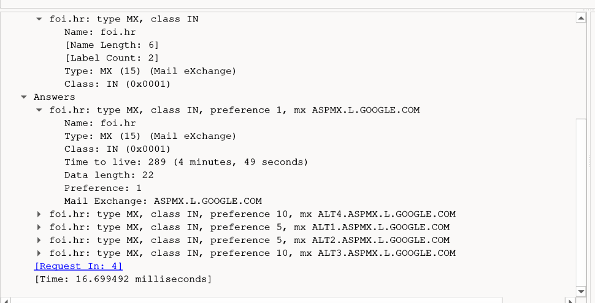

---

### Pitanje 23.

**Pitanje:**
Kako ste saznali IP-adresu poslužitelj e-pošte za foi.hr domenu koji ima najmanju vrijednost polja “Preference”? Koja je IP-adresa tog poslužitelja.

**Odgovor:**
IP adresu poslužitelja e-pošte za foi.hr sam saznao tako da sam u shell upisao nslookup ASPMX.L.GOOGLE.COM. IP adresa poslužitelja je 142.251.127.26.

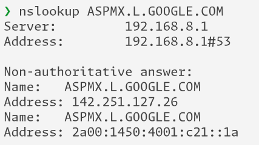

--- 

### Osvrt
Ova vježba mi je pomogla u shvaćanju aplikacijskog sloja. Kroz vježbu sam naučio čemu služe i kako se koriste naredbe nslookup i ipconfig, te mi je također jasnije kako funkcioniraju poruke upita i odgovora te kako su IP adrese izvora i odredišta (ovisno o vrsti DNS poruke) jednake IP adresi mog lokalnog poslužitelja DNS-a.