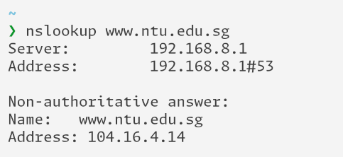

# Druga seminarska zadaća iz Mreža računala - DNS
## Hrvoje Kajba - IPS2-S-G13

---

### Pitanje 1.

**Pitanje:**
Pomoću nslookup saznajte IP adresu (verzije 4) web poslužitelja Nanyang tehnološkog sveučilišta iz Singapura. Naziv tog web-poslužitelja je www.ntu.edu.sg.

**Odgovor:**
`nslookup` za www.ntu.edu.sg vraća 192.168.8.1 kao IP računala na toj adresi. IP poslužitelja je 104.16.4.14.

---

### Pitanje 2.

**Pitanje:**

**Odgovor:**

---

### Pitanje 3.

**Pitanje:**

**Odgovor:**

---

### Pitanje 4.

**Pitanje:**

**Odgovor:**

---

### Pitanje 5.

**Pitanje:**

**Odgovor:**

---

### Pitanje 6.

**Pitanje:**

**Odgovor:**

---

### Pitanje 7.

**Pitanje:**

**Odgovor:**

---

### Pitanje 8.

**Pitanje:**

**Odgovor:**

---

### Pitanje 9.

**Pitanje:**

**Odgovor:**

---

### Pitanje 10.

**Pitanje:**

**Odgovor:**

---

### Pitanje 11.

**Pitanje:**

**Odgovor:**

---

### Pitanje 13.

**Pitanje:**

**Odgovor:**

---

### Pitanje 14.

**Pitanje:**

**Odgovor:**

---

### Pitanje 15.

**Pitanje:**

**Odgovor:**

---

### Pitanje 16.

**Pitanje:**

**Odgovor:**

---

### Pitanje 17.

**Pitanje:**

**Odgovor:**

---

### Pitanje 18.

**Pitanje:**

**Odgovor:**

---

### Pitanje 19.

**Pitanje:**

**Odgovor:**

---

### Pitanje 20.

**Pitanje:**

**Odgovor:**

---

### Pitanje 21.

**Pitanje:**

**Odgovor:**

---

### Pitanje 22.

**Pitanje:**

**Odgovor:**

---

### Pitanje 23.

**Pitanje:**

**Odgovor:**

---

### Pitanje 24.

**Pitanje:**

**Odgovor:**

---
