# Programsko inženjerstvo - skripta za usmeni ispit

Hrvoje Kajba - IPS-G2

## 1. Analiza i specifikacija zahtjeva

**Vrste zahtjeva:**

- _Funkcionalni zahtjevi_ - opisuju zahtjevanu funkcionalnost ili ponašanje sustava, npr. mogućnost upisa ocjene studentu,
- _Nefunkcionalni zahtjevi_ - opisuju ograničenja nad sustavom i njegovom funkcionalnošću, npr. sustav mora napraviti ovo i ovo u određenom vremenu (performanse) i
- _Domenski zahtjevi_ - mogu biti funkcionalni ili nefunkcionalni i predstavljaju specifičnosti aplikativne domene.

**Funkcionalni zahtjevi** ovise o sustavu, softveru i korisnicima. Mogu biti izraženi sa različitom količinom detalja, te je za sustav poželjno da ima kompletan i konzistentan set funkcionalnih zahtjeva. _Kompletnost_ označava da su sve zahtjevane funkcionalnosti opisane, a _konzistentnost_ označava da nema kontradikcija u opisu zahtjeva.

**Nefunkcionalni zahtjevi** se najčešće odnose na sustav kao cjelinu, te su često bitniji od pojedinim funkcionalnih zahtjeva. Djele se na: _zahtjevi proizvoda, zahtjevi organizacije i vanjski zahtjevi_.

**Sistemski/softverski zahtjevi** su detaljna specifikacija korisničkij zahtjeva. Korišteni su od strane developera kao osnova za razvoj programskog rješenja, trebali bi odgovoriti na pitanje ŠTO sustav treba raditi (a ne KAKO to sustav treba raditi) i pod kojim uvjetima i ograničenjima to treba raditi.

**Aktivnosti inženjerstva zahtjeva:**

- _Studija izvedivosti_ - procjena je li sustav koristan za poslovanje,
- _Elicitacija i analiza_ - otkrivanje zahtjeva,
- _Specifikacija_ - preobražaj zahtjeva u dogovoren standardni oblik/obrazac i
- _Validacija_ - provjera da svi zahtjevi uistinu definiraju ono što klijent želi.

**Studija izvedivosti** je kratka studija koja se izvodi u početnim stadijima razvoja i nastoji odgovoriti na tri pitanja:

1. _Doprinosi li sustav općim golovima organizacije?_
2. _Može li se sustav implementirati u roku i unutar proračuna?_
3. _Može li se sustav implementirati sa drugim sustavima koji se već koriste?_

**Elicitacija i analiza** se sastoji od četiri glavna koraka: _otkrivanje zahtjeva, klasifikacija i organizacija zahtjeva, prioritiziranje i pregovaranje zahtjeva i specifikacija zahtjeva_.

## 2. Osnovne objektno orijentiranog pristupa

Objektno orijentirani pristup u fokusu ima _objekt_, odnosno _klasu_. Klasa predstavlja skup atributa i metoda, a objekt je instanca tog tipa. Deklaracija objekta podrazumijeva i definiranje strukture kroz koju se taj objekt deklarira (klasa).

Klase mogu imati prava pristupa:

- **private** - atributima može pristupiti samo ista klasa,
- **protected** - atributima može pristupiti ista klasa, klasa u istom paketu ili klasa koja nasljeđuje ovu klasu,
- **public** - atributima mogu pristupiti sve klase.

Klase mogu nasljediti neke atribute i metode od svojih klasa roditelja (nadklase). Nadklase sadrže atribute i metode koji su zajednički za više klasa koje od nje nasljeđuju, a podklase sadrže te atribute i metode, te dodatne koje programer naknadno definira.

## 3. Uvod u UML

U UML 2.0 definirano je 13 vrsti dijagrama, podjeljenih u tri podskupine:

- **Dijagrami strukture**
    1. Dijagram klasa
    2. Dijagram objekata
    3. Dijagram komponenata
    4. Dijagram složenih struktura
    5. Dijagram paketa
    6. Dijagram razmještanja
- **Dijagram ponašanja**
    1. Dijagram slučajeva korištenja
    2. Dijagram aktivnosti
    3. Dijagram strojeva stanja
- **Dijagrami međudjelovanja**
    1. Dijagram slijeda
    2. Dijagram pregleda međudjelovanja
    3. Dijagram komunikaciej
    4. Dijagram vremenskog usklađenja

## 4. Dijagram slučajeva korištenja

Opisuje _što_ sustav radi, s motorišta vanjskog promatrača. Nije bitno _kako_ sustav funkcionira iznutra. Dijagram slučajeva korištenja je najviša razina opisa funkcionalnosti sustava i odnosa sa okolinom.

Promatrani sustav prikazuje se pravokutnikom. Učesnici su povezani sa slučajevima korištenja (primarni učesnici, npr. korisnici, se prikazuju s lijeve strane, a sekundarni učesnici, npr. poslužitelj, se prikazuju sa desne).

_Slučaj korištenja_ je skup akcija koji neki sustav može izvesti u međudjelovanju sa učesnicima. Slučaj korištenja je priča koja opisuje kako učesnici koriste sustav da bi postigli određene ciljeve ili obavili poslove.

_Učesnik_ je skup podudarajućih uloga koje korisnici imaju u interakciji sa slučajem korištenja. Učesnik je netko van promatrananog sustava, koji se s njim u interakciji, ali nije sam dio njega. Predstavlja skup uloga koji korisnici igraju u svojoj interakciji sa pojedinim sustavom. _Primarni učesnik_ pokreće interakciju sa sustavom i izvodi neki slučaj korištenja, a _sekundarni učesnik_ nadzire izvođenje nekog slučaja korištenja ili obavlja neki zadatak nakon što ga slučaj korisnika pozove.

_Veza_ je sudjelovanje korisnika u slučaju korisnika, odnosno komunikacija između učesnika i slučaja korištenja ili dva slučaja korištenja.

- **Uključi (`<<include>>`) veza** - veza od _osnovnog_ slučaja korištenja prema _uključenom_ slučaju korištenja, koja označava da osnovni slučaj korištenja sadrži ponašanje uključenog slučaja korištenja (slučaj korištenja _Plati račun_ sadrži ponašanje _Ažuriraj status korisnika_),
- **Proširi (`<<extend>>`) veza** - veza od slučaja korištenja koji je _proširenje_ prema _osnovnom_ slučaju korištenja, označava da se ponašanje osnovnog slučaja korištenja proširuje ponašanjem proširenja (slučaj korištenja _Plati račun_ je proširen ponašanjem slučaja korištenja _Plati karticom_).

U modelu slučaja korištenja se nalaze dva dijela: _dijagram slučajeva korištenja_ i _specifikacija slučajeva korištenja_. Dijagram je iznad opisan, a specifikacija je tekstualni opis s kojim se daje kontekst na dijagram slučajeva korištenja.

## 5. Dijagram klasa

Dijagram klasa je strukturni statički dijagram, prikazuje klase, atribute i operacije klasa nekog sustava. Ne prikazuje privremene informacije koje su vezane za izvođenje radnji u nekom sustavu. Služi za modeliranje i skiciranje klasa i njihovih statičkih odnosa, rječnika podataka sustava i logičkog modela podataka.

Dijagrami klasa imaju različite razine apstrakcije:

- _konceptualne_ - analitički model struktura podataka i poslovnih pravila,
- _logička_ - detaljni dizajn, prikaz sučelja objekata i
- _fizička_ - kod, primjenjive komponente.

**Klasa** predstavlja skup objekata sa istim atributima, operacijama i odnosima sa objektima drugih klasa. Klasa je apstrakcija jer naglašava relevantne osobine, ali skriva druge osobine i njihovu implementaciju. Objekt je instanca klase.

Kanonske konceptualne klase su:

1. **Ljudi i njihove uloge** - uloge ljudi i organizacija (Putnik, Prijevoznik) i skup osoba (PutnikNaLetu, PilotNaLetu),
2. **Stvari, predmeti poslovanja i fizičke lokacije** - proizvod ili usluga (Sjedalo, Obrok), fizička lokacija (Aerodrom, Terminal), fizički objekt (Avion, KreditnaKartica, Sjedalo) i skup stvari (SjedalaNaAvionu),
3. **Događaji i poslovne tranzakcije** - poslovna tranzakcija (RezervacijaSjedalaNaLetu, BankovnaDoznaka), stavka tranzakcije (RezervacijaSjedala, Račun) i događaj (Ukrcavanje, PolazakAviona),
4. **Dokumenti** - opis stvari (PlanLeta), katalog (RedLetenja, RasporedDolazaka) i zapis/dokumentaciju o radu (AgencijskiUgovor, DnevnikOdržavanja),
5. **Vanjski sustavi** - vanjski sustav (KontrolaLeta, PutničkaAgencija, TaksiPrijevoznik).

Klasa se u dijagramu sastoji od tri dijela:

| Naziv klase                         |
| ----------------------------------- |
| +attribute : Type name              |
| +operation (arguments): return Type |

Za atribute u klasi moramo odrediti njihovu vidljivost. Ona može biti:

- **public (+)** - atribut je dostupan svim klasama i paketima,
- **protected (#)** - atribut je dostupan unutar iste klase ili paketa,
- **private (-)** - atribut je dostupan samo unutar iste klase,
- **package (~)** - atribut je dostupan svim klasama istog paketa i
- **derived (/)** - atribut je izveden od drugih atributa pa preuzima najrestrektivniju vrijednost od tih atributa.

Operacije su sučelja objekta prema njegovoj okolini, pomoću njih se mjenja vrijednost atributa, izvršavaju neke radnje i sl. Metoda je implementacija operacije.

Postoje operacije/metoda posluživanja, to su:

1. **konstruktor** - određuje vrijednosti nekih atributa pri kreiranju objekta (isto ime kao klasa),
2. **pristup, selektor** - vraća podatke čitanjem nekog atributa (GetAttribute()...),
3. **modifikator** - mjenja stanje nekog atributa (SetAttribute()...),
4. **destruktor** - za dinamičke strukture ga osigurava kompilator (RemoveAttribute()...).

**Asocijacija** je veza kojom se određuje da su instance jedne klase povezane sa instancama druge klase. Prikazuje suradnju na razini klasa i veze među instancama klasa. Asocijacije imaju karakteristike uloga, usmjerenja i kardinalnosti.

Vrste asocijacija su generalizacija, agregacija i kompozicija.

**Generalizacija** je veza među klasama kod koje podklasa _nasljeđuje_ atribute i operacije nadklase. Crta se kao prazna strelica od podklase prema nadklasi.

**Agregacija** prikazuje da se nešto sastoji od dijelova (part-of). Agregacija može biti jaka (_kompozicija_) ili slaba (_djeljiva agregacija_). Crta se tako da se dijamant na crti asocijacije stavi kod cjeline, pa se potom crtom spoji na dio. Dijamant može biti puni (kompozicija) ili prazan (djeljiva agregacija).

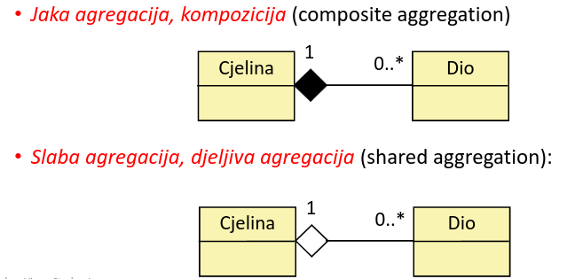

**Kompozicija** je jači oblik agregacije, svaki dio u jednom trenutku može biti član samo jedne cjeline. Ako se obriše cjelina, brišu se i svi njezini dijelovi. Dio se može obrisati, a cjelina ostaje.

**Djeljiva agregacija** je slabiji oblik, često označava virtualno grupiranje. Jedan klasifikator koristi drugog, ali ga ne sadrži i može ga dijeliti.

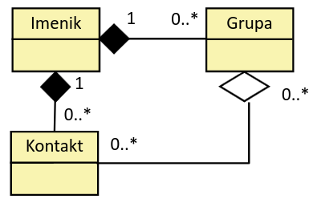

_Imenik_ sadrži instance _Grupa_ i _Kontakt_, ako se izbriše _Imenik_ nestaju i te dvije instance. No, ako se izbriše _Kontakt_ ne nestaju _Imenik_ i _Grupa_, isto tako je i ako se obriše _Grupa_.

## 6. Dijagram objekata

Objekt je instanca klase. Objekt se u dijagramu definira ovako:

| objektNaziv:NazivKlase |
| ---------------------- |
| atribut_1=vrijednsost  |
| atribut_2=vrijednost   |

Objekt u dijagramu može biti imenovani ili neimenovani, znači može ali ne mora sadržavati objektNaziv, no uvijek mora imati NazivKlase.

Dijagrami objekta su strukturni statički dijagrami koji prikazuju instancu elemenata koji su prikazani na dijagramu klasa. Prikazuje objekte i poveznice objekta u određenom vremenskom trenutku. Koristi se kada želimo proučiti strukture objekata ili kada nas zanima dinamička struktura objekta.Koristimo ga kod vizualizacije, specificiranja, konstrukcije i dokumentiranja postojanja trenutnih instanci u našem sustavu, zajedno sa vezama između njih.

## 7. Dijagram slijeda i komunikacije

Dizajn programskog sustava sadrži više aktivnosti, koje se mogu izvoditi iterativno:

1. Detaljna razrada i profinjavanje _strukturnih dijagrama_, prije svega _dijagrama klasa i objekata_,
2. Izrada modela međudjelovanja (interakcije): _dijagrami slijeda_ i _dijagrami komunikacije_,
3. Ako objekt prolazi kroz više stanja, ponašanje objekta se prikazuje _modelima ponašanja_, npr. _dijagramima strojeva stanja_.

Dijagrami slijeda i komunikacije prikazazuju model dinamike sustava i razmjenu poruka između objekata.

**Dijagram slijeda** prikazuje kako objekt tijekov svog života komunicira sa drugim objektima. Međudjelovanje objekata na dijagramu prikazano je kronološki, od početka do kraja, od gore prema dolje. Dijagram slijeda je model dinamike sustava: pokazuje ono što se događa u sustava kada se desi neki događaj (odnosno kada objekt šalje neku poruku), ako u nekom scenariju nije bitna vremenska komponenta i slijedom komunikacije objekata, nema smisla ga crtati.

Dijagram slijeda za scenarij korištenja prikazuje kako se odnos sustava i okoline odražava na objekte u sustavu. On je komplementaran dijagramu aktivnosti jer opisuje kako se ostvaruje funkcionalnost sustava. Detaljniji je od komunikacijskih dijagrama jer osim samo poruka koje se razmjenjuju prikazuje i redoslijed poruka, odnosno tijek komunikacije.

**Životna crta** prikazuje kronologiju ponašanja učesnika (objekta) u komunikaciji. Crta se kao okomita iscrtkana crta, no kada je objekt 'aktiviran' onda se crta kao prazan pravokutnik na toj crti.

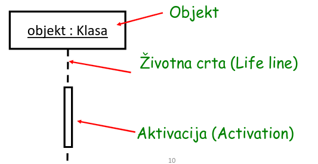

**Poruka** prikazuje komunikaciju dva objekta u interakciji. **Interakcija** je jedinica ponašanja, na dijagramu slijeda je prikazana kao razmjena informacija među objektima. Interakcija je opis ponašanja, ali i opis međudjelovanja aktivnih objekata.

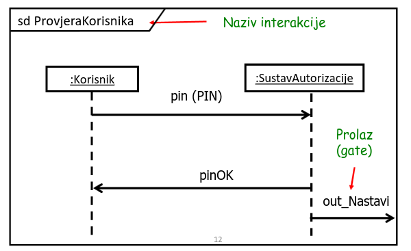

Postoji više vrsta poruka:

- **sinhrona poruka** - daljnje izvršenje na objektu se zaustavlja sve dok se ne vrati odgovor na ovu poruku,
- **asinhrona poruka** - ne čeka se na odaziv,
- **plošna poruka** - nije važno ako je sinhrona ili asinhrona
- **povratna poruka** - vraćanje kontrolnog toka pošiljatelju poruke

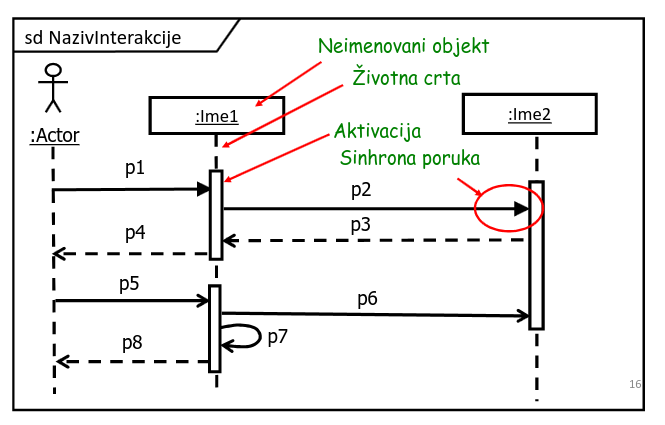

Dijagram slijeda omogućuje korištenje stereotipove objekata, tri primarna tipa stereotipa su:

1. **Granična klasa** - nalazi se na granici između našeg sustava i ostatka svijeta (forme, izvješća...), granična klasa dozvoljava korisniku interakciju sa sustavom.
2. **Kontrolna klasa** - odgovorna je za koordinaciju ponašanja ostalih klasa u skladu s poslovnim pravilima i nema drugu svrhu.
3. **Klasa entiteta** - klasa za koju želimo posebno naglasiti da se njezine informacije trajno pohranjuju čak i nakon njezine terminacije, najčešće predstavlja bazu, tablicu, datoteku ili slično.

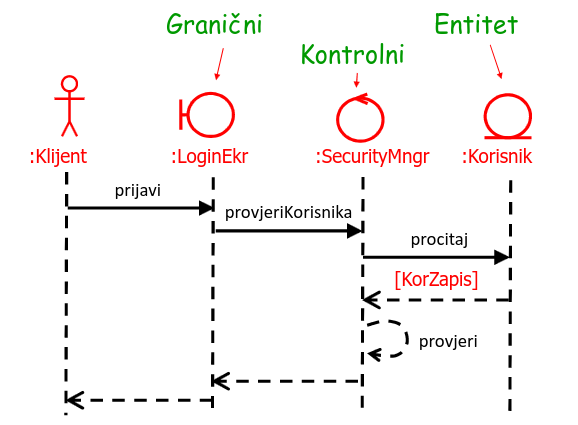

**Dijagram komunikacije** je usmjeren strukturnim aspektima komunikacije objekata, odnosno objektima koji sudjeluju u komunikaciji i koje poruke razmjenjuju. Dijagram slijeda je usmjeren vremenskom tijeku komunikacije. Dijagram komunikacije ne omogučava napredne koncepte (loop, break...) i podrazumijeva da redoslijed primanja poruka nije bitan.

## 8. Dijagram aktivnosti

**Dijagram aktivnosti** je dijagram ponašanja, ekvivalent dijagrama toka ili dijagrama toka podataka iz strukturnog doba.

Realizacija slučaja korištenja:

1. **Dijagramom slučajeva korištenja** predstavljamo vanjski pogled na sustav,
2. **Realizacija slučajeva korištenja** predstavljamo implementacijski pogled na slučaj korištenja,
3. Realizacija se provodi sljedečim dijagramima:
    - **Dijagramom aktivnosti** - koristi se ukoliko je slučaj korištenja bitan proces, odnosno tijek posla
    - dijagramima interakcije (dijagram komunikacije i dijagram slijeda)
    - dijagramom klasa

Dijagram aktivnosti prikazuje _akcije, njihov redoslijed i prijenos kontrole među akcijama_. Aktivnost utjelovljuje ponašanje, akcije su elementarne jedinice ponašanja.

Dijagram aktivnosti se koristi za modeliranje procesne logike unutar jednog slučaja ili scenarija korištenja.

## 9. Dijagram stanja

Stroj stanja je model ponašanje i dinamike jednog objekta sustava. Stroj stanja prikazuje:

- diskretna stanja koja bi objekt mogao imati tijekom svog životnog ciklusa,
- početnu i završnu točku u prikazanom nizu promjena stanja,
- moguće prijelaze iz stanja u stanje,
- uvjete i efekte prijelaza.

**Simbol stanja** je pravokutnik sa zaobljenim rubovima, a **prijelaz stanja** (tranzicija) se prikazuje usmjerenim strelicama. **Početno pseudostanje** se označuje kao ispunjen crni krug, a **završno pseudostanje** kao ispunjen crni krug sa praznim obrubom.

**Dinamika objekta** očituje se kroz promjene njegovog stanja, koje nastaju kao posljedica djelovanja drugih objekata. Za objekt koji prima poruku, ona je događaj koji može izazvati njegovu promjenu stanja i aktivnosti. Kao rezultat promjene stanje jednog objekta može nastati poruka drugom objektu, preduvjet za to je da objekt koji prima poruku ima odgovarajuću metodu, metodu posluživanja.

Prijelaz stanja ima četiri komponente:

1. **Tranzicija** - vektor koji predstavlja iz kojeg u koje stanje se ide,
2. **Događaj i argumenti** - događaj i argumenti koji potiču prijelaz stanja,
3. **Zaštita** - uvjet koji mora biti ispunjen da dođe do prijelaza stanja i
4. **Efekt** - posljedica do koje dolazi pri prijelazu stanja.

Na strijelici tranzicije, događaj i argumenti, zaštita i efekt se formatira ovako: `događaj(argumenti)[zaštita]/efekt`.

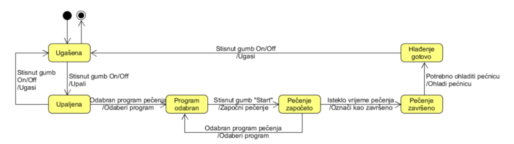

## 10. Dijagram paketa

Simbol paketa je četverokut s upisanim nazivom i jahačem. Paket se koristi za grupiranje elemenata i osigurava imenski prostor za grupirane elemente. Paket je element modula koji može sadržavati druge pakete i ostale elemente modula, kao što su klase, slučajevi korištenja, komponente i slično. U programskom kodu interpretira se kao `namespace` u C#/C++ ili kao `package` u Javi. Paketi se prvenstveno koriste kako bi se savladala kompleksnost jer pojedini sustavi mogu imati stotine klasa te je modele u takvim sustavima teško organizirati. Paketi omogućuju sagledavanje pojedine logički, funkcionalno ili na drugi način povezane dijelove.

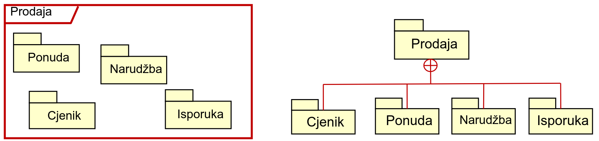

Svaki dijagram klasa je zapravo paket. _Paketi su virtualna spremišta u koja se stavljaju klase slične namjene_. Kriteriji grupiranja klasa u paket su:

1. Promjene u jednoj klasi utječu na promjene u drugoj klasi
2. Klasa je povezana sa asocijacijama baš s klasama u tom paketu
3. Objekti klase su u interakciji preko većeg broja poruka

## 11. Dijagram komponenta

**Komponenta** je posebna vrsta klase koja reprezentira zamjenjivi dio sustava (jedinicu). Komponenta učahuruje svojstva i operacije (unutarnja struktura svojstva se modelira dijagramima složene strukture). Komponenta omogućava okolini da koristi njezinu funkcionalnost pomoću sučelja, a na jednak način (pomoću sučelja) koristi tuđu funkcionalnost. Komponenta može biti zamjenjena drugom komponentom ako su one obije _konformne_ (ako obije zadovoljavaju iste specifikacije sučelja i njihovu statičku i dinamičku semantiku). Simbol komponente je pravokutnik s posebnom oznakom `<<komponenta>>`.

Dijagram komponenta prikazuje kako se funkcionalnost programskog sustava ostvaruje pomoću međusobno povezanih komponenta. Komponente su izvršni, izmjenjivi dijelovi čija je implementacija skrivena. Funkcionalnost i pristup komponenti ostvaruje se pomoću sučelja:

- komponenta pruža svoju funkcionalnost pomoću sučelja koje daje ostalim komponentama,
- komponenta može tražiti sučelje od druge komponente kako bi funkcionirala

Kako bi komponente funkcionirale u međudjelovanju, komponente svojoj okolini osiguravaju sučelja, ali isto traže i od svoje okoline. Ovo se postiže Ball & Socket sučeljem:

1. **Ball** - sučelje koje omogućuje drugim komponentama da koriste njezine funkcionalnosti
2. **Socket** - sučelje koje komponenti omogućuje da koristi funkcionalnost drugih komponenti

Uz to postoje i Stereotype i Listing sučelje.

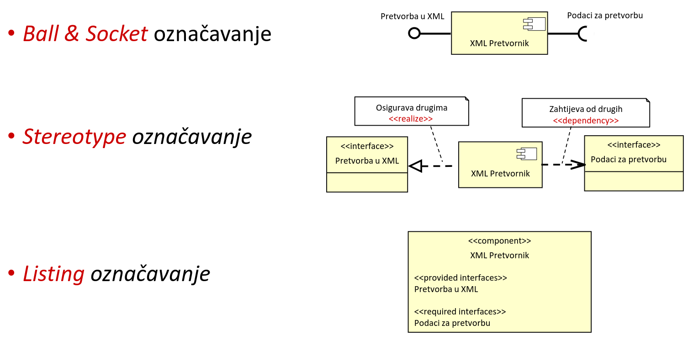

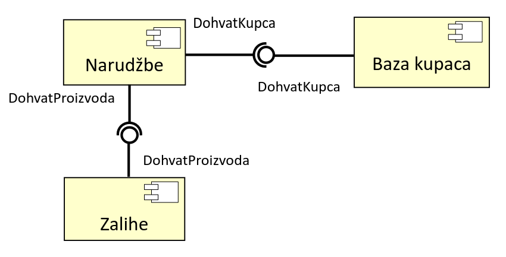

Postoje dva pristupa unutarnjoj strukturi komponente: komponenta kao bijela i komponenta kao crna kutija.

**Komponenta kao crna kutija** govori da nije važna unutarnja struktura komponente, već samo sučelja koja komponenta osigurava ili zahtjeva, te artefakti koji opisuju ponašanje (dokumentacija).

**Komponenta kao bijela kutija** govori da je bitna unutarnja struktura komponente te informacija o tome koji klasifikator (komponenta ili klasa) unutar komponente odrađuje koju funkcionalnost ili osigurava da funkcionalnost bude izvršena.

## 12. Programski koncepti

C# je objektno orijentirani jezik - programska logika mora biti zadržava unutar definicije tipa, ne postoje globalne funkcije/varijable.

U C# postoje dvije vrste tipa podataka: složeni i jednostavi. Složeni tipovi podatak su: _strukture i klase, varijable, reference i objekti, polja i liste i stringovi_. Jednostavni tipovi podataka su: _int, float, double, decimal, byte, char, bool i sl._

**Varijable** su elementi programskog koda u koje pohranjujemo podatke, svaka varijabla mora imati definiran svoj tip podataka i ime.

**Strukture i klase** su složeni tip podataka koji se može sastojati od više varijable različitih tipova podataka, razlika između struktura i klasa je to što klase unutar sebe mogu imati programsku logiku (funkcije -> metode), dok strukture nemaju tu mogućnost.

**Reference** su varijable složenog tipa, na njim možemo misliti kao pokazivače iz C/C++ ali puno jednostavnije. Reference je pokazivač na **objekt** odnosno instancu neke klase.

**Enumeracije** su simbolička imena preko kojim mapiramo poznate numeričke vrijednosti:

```cs
enum TipZaposlenika {
    PomocnoOsoblje = 0,
    Voditelj = 1,
    Serviser = 2,
    Vozac = 3
}
```

**Implicitna pretvorba tipova** se pojavljuje kod pretvorbe iz manje preciznih u više precizne tipove:

- `byte -> short -> int -> long -> decimal`
- `int -> double`
- `short -> float -> double`
- `char -> int`

Primjer:

```cs
decimal brojevi = 73;
decimal prosjek =  (5+5+3+4+5) / 5;
```

**Eksplicitna pretvorba tipova** je ručna pretvorba jednog tipa u drugi radi prijenosa vrijednosti. Primjer:

```cs
int ukupniBrojevi = (int)93.1313;
float djelitelj = 5;
decimal rezultatDjeljenja = 2 / (decimal)djelitelj;
```

Postoji nekoliko standarda imenovanja elemenata programskog koda, što ovisi o jeziku i tehnologiji, ali i samim programerima. Tri poznate notacije za imenovanje su:

1. **Pascal** - `OvoJeIme`
2. **CamelCase** - `ovoJeIme`
3. **Mađarska** - `dbPodatak` (double - tip, Podatak - ime varijable)

## 13. Korisnička sučelja i korisničko iskustvo

Zadatak programera je razviti iluziju jednostavnosti pri korištenju aplikacije. Iz perspektive korisnika, glavnu ulogu u tome ima korisničko sučelje. **Korisničko sučelje** je dio računalnog programa koji korisnicima omogućava interakciju sa njim.

Postoje različite vrste korisničkih sučelja: _naredbeni redak, grafičko sučelje (GUI), glasovno sučelje (Alexa, Siri...), sučelje komunikacije u prirodnom jeziku (chatbot) i AR/VR sučelje._

Za razvoj .NET aplikacija postoje tri glavne GUI tehnologije:

1. **WinForms**
    - tradicionalna i stabilna tehnologija koja se koristi za razvoj Windows GUI aplikacija
    - omogućuje izradu korisničkog sučelja pomoću grafičkog dizajnera
    - omogućuje _programiranje vođenog događajima_ (event-driver programming)
2. **Windows Presentation Foundation (WPF)**
    - modernija, fleksibilnija i moćnija tehnologija za razvoj Windows GUI aplikacija
    - koristi _XAML_ (eXtensible Application Markup Language) za definiranje elemenata sučelja
3. **Universal Windows Platform (UWP)**
    - koristi se za izradu aplikacija koje se mogu pokrenuti na različitim uređajima unutar Microsoft ekosustava (stolna računala, XBOX, i sl.)
    - također koristi XAML za definiranje elemenata sučelja
4. **.NET MAUI**
    - framework za izradu višeplatformskih aplikacija
    - omogućuje razvoj aplikacija koje se mogu pokrenuti na Windows, MacOS i Linux (uključujući Android) operacijskim sustavima
    - također koristi XAML za definiranje elemenata sučelja

**Korisničko iskustvo** odnosi se na cjelokupno iskustvo i zadovoljstvo koje korisnik ima u interakciji s proizvodom, sustavom ili uslugom. Neki od elemenata korisničkog iskustva su:

- istraživanje korisnika
- informacijska arhitektura
- dizajn interakcije
- vizualni dizajn
- testiranje upotrebljivosti
- pristupačnost

U korisničkom iskustvu postoje tri **_zlatna pravila_** kojih se vrijedi držati:

1. **Prepustiti kontrolu korisniku**
    - definirati interakciju na način da ne tjera korisnika na nepotrebne ili neželjene radnje (_MS Word - automatsko spremanje datoteke, Web preglednik - automatsko otvaranje `.pdf` dadoteka..._)
    - omogućiti fleksibilnu interakciju (_mogućnost kopiranja putem desni klik -> copy i putem CTRL+C_)
    - omogućiti prekid i poništenje interakcije (_undo/redo opcija, odustani opcija, dodatna potvrda kod brisanja..._)
    - omogućiti izravnu interakciju korisnika s objektima koji se pojavljuju na zaslonu (_drag & drop privitna u mail aplikacijama_)

2. **Smanjiti kognitivno opterećenje korisnika**
    - uspostaviti smislene zadane postavke (_prilikom instalacije većina postavka je već definirana, uključujući instalacijski direktorij_)
    - definirati intuitivne prećice (_CTL+Z je undo, ALT+F4 zatvara prozor, CTRL+P printa stranicu..._)
    - temeljiti vizualni izgled sučelja na metafori iz stvarnoga svijeta (_disketa predstavlja spremanje, koš za smeće predstavlja brisanje..._)
    - organizirati sučelje hijerarhijski kako bi se omogućilo progresivno otkrivanje informacija (_tražilice prvo prikazuju jednostavno pretraživanje, ali postoji mogućnost i pretraživanja po kriterijima_)

3. **Osigurati dosljednost sučelja**
    - omogućiti korisniku da trenutni zadatak stavi u smisleni kontekst (_prikazivanje progress linije prilikom instalacije/ažuriranja/izvršavanja dugotrajnih procesa_)
    - održati dosljednost dizajna u sklopu cijele aplikacije (_sve aplikacije u alatu Office imaju sličan i poznat dizajn_)
    - ukoliko su prethodne verzije aplikacije stvorile korisnička očekivanja, promjene se rade samo ako postoje dobro opravdani razlozi za njih (_Windows 8 je maknuo klasičan start menu, bili su ga prisiljeni vratiti zbog pritiska korisnika_)

## 14. Pogreške u programskom kodu

U C# postoje tri vrste pogrešaka u programskom kodu:

1. Greške u sintaksi programskog koda (syntax error)
2. Greške tijekom izvođenja programa (runtime error)
3. Greške u logici programa

O greškama u sintaksi programskog koda nas obavještava sam IDE prilikom pokušaja kompiliranja programa. Primjer:

```cs
// krivo definirana klasa
public classe Klasa {...}

// upotreba nedeklarirane varijable
varijabla = 10;
```

Primjer pogreške tijekom izvođenja:

```cs
// pokušaj inicijalizacije objekta sa null
Form newForm = null;
newForm.ShowDialog();

// pokušaj djeljenja sa nulom
int varijablaJedan = 10;
int varijablaDva = 0;
double rezultat = (double)varijablaJedan / varijablaDva;
```

Primjer logičke greške:

```cs
private double PovrsinaKruga(double r) {
    // logicka pogreška kod izračuna površine kruga - kriva formula
    return r * Math.PI;
}
```

Pogreške otkalnjamo na tri načina: _postavljanjem točka prekida, prolaskom kroz kod i debug prozorima_. Ova tri koraka predstavljaju proces koji se zove debugiranje. Postavljanjem točka prekida možemo odrediti u kojem trenutku izvođenja programa će ono stati, ovime možemo polako prolaziti kroz kod sve dok ne vidimo gdje se točno greška nalazi. U debugiranju kroz kod možemo prolaziti na više načina, možemo birati koje linije se izvršavaju, kako se izvršavaju i sl. Debug prozor nam govori varijable, objekte i ostale elemente koda koji su na stacku te koje su njihove vrijednost i tipovi.

U kodu također možemo upravljati očekivanim iznimkama:

```cs
try
{
    // pokusaj otvoriti datoteku
    datoteka = new FileInfo(@"direktorij/nepostojeca_datoteka.txt");
    stream = datoteka.OpenRead();
}
catch (FileNotFoundException)
{
    // ako datoteka nije pronadena, kreiraj ju
    File.Create(@"direktorij/nepostojeca_datoteka.txt")
    datoteka = new FileInfo(@"direktorij/nepostojeca_datoteka.txt")
    stream = datoteka.OpenRead();
}
finally
{
    // dealociraj resurse ovisno o pojavi iznimke
    datoteka = null;
    stream = null;
}
```

## 15. Osnove `git` sustava za verzioniranje

Za razumijevanje `git`-a prvo trebamo objasniti par osnovnih koncepata:

- **Radna kopija** - lokalna mapa (na računalu programera) s datotekama (npr. izvorni kod) nad kojom `git` nadzire promjene
- **Commit** - snimka radne kopije u nekom trenutku u kojem ju programer želi spremiti
- **Repozitorij** - posebna pohrana/baza podataka za čuvanje verzija softvera (commitovi)

Po defaultu `git` ne prati promjene u našim direktorijima. Da bi on pratio promjene, trebamo ili inicijalizirati ili klonirati git repozitorij. Nakon što smo to napravili, u radnoj kopiji možemo vidjeti `.git` direktorij koji sadrže sve datoteke potreben za `git`-ov rad.

Nakon što smo napravili neke izmjene u radnoj kopiji, možemo ih dodati na commit stack pomoću `git add`. Nakon toga ih pomoću `git commit -m "..."` i `git push` možemo poslati na repozitorij s kojim radimo.

Ako radimo sa više programera, također trebamo koristiti `git pull` s kojim skidamo promjene sa centralnog repozitorija i `git push` s kojim šaljemo svoje promjene na repozitorij.

## 16. Provjera softvera

**Kvaliteta softvera** je razina kojom softver ispunjava potrebe i očekivanja korisnika, izvršava ispravno funkcionalnosti koje nudi te ne rezultira neželjenim posljedicama ili štetom.

Testiranjem osiguravamo da kod radi ono što bi trebao da radi, te da to radi ispravno. Tesitranje pomaže pronaći scenarije u kojima se naš softver ponaša neispravno, neočekivano ili na neželjen način. Testiranje je dio šireg procesa poznatog kao _verifikacija_ i _validacija_.

**Verifikacija** je proces utvrđivanja je li softver izrađen ispravno i u skladu za zahtjevima klijenta. Verifikacija može početi u ranom stadiju razvoja softvera jer ne zahtjeva nužno pokretanje softvera. Verificirati možemo rezultate/artefakte bilo koje faze razvoja softvera, uključujući: _specifikaciju zahtjeva, dizajn, programski kod, testni plan, korisničku dokumentaciju_.

Često korištene statičke metode verifikacije su:

- recenzije,
- prolasci,
- inspekcije i
- provjere.

Često korištene dinamičke metode verifikacije su:

1. **Funkcionalno testiranje**
    - _jedinični testovi, integracijski testovi i sistemski testovi_
2. **Nefunkcionalno testiranje**
    - testiranje performansi, sigurnosti, opterećenja, kompatabilnosti...

**Validacija** je proces kojim utvrđujemo je li implementirani softver u skladu s potrebama i očekivanjima korisnika. Obično se provodi nakon verifikacije (kada se kod već može pokrenuti). U okviru validacije provodimo testiranje softvera u realističnom okruženju, iz perspektive korisnika. Zbog toga se primarno koriste dinamičke metode testiranja:

1. **Funkcionalno testiranje** - korisničko testiranje prihvaćanja, A/B testiranje
2. **Nefunkcionalno testiranje** - testiranje upotrebljivosti, testiranje pristupačnosti

U procesu validacije prevladava manualno testiranje. Zadužena su podjeljena između razvojnog tima (s naglaskom na QA specijaliste i testere) te predstavnike krajnjih korisnika i naručitelja. Svi zajedno sudjeluju u definiranju kriterija prihvatljivosti softvera, te utvrđuju ispunjava li softver te kriterije.

**Piramida testiranja** je okvir koji ilustira potrebu za testovima na različitoj razini granulacije:

1. Baza: **jedinično testiranje**
    - testiraju se jedinice koda (metode, funkcije i sl.) u izolaciji
    - brzi su (često unutar par milisekundi), u potpunosti automatizirani, te ih ima najviše (preko 60%)

2. Sredina: **integracijski testovi**
    - fokusiraju se na testiranje interakcije između više modula
    - sporiji su (>50 milisekuni), obično automatizirani, te ih ima oko 30%

3. Vrh: **sistemski testovi**
    - testiraju cijelokupan sustav (od GUI-a do baze podataka)
    - vrlo spori (sekunde), manualni ili djelomično automatizirani, te čine oko 10% testova

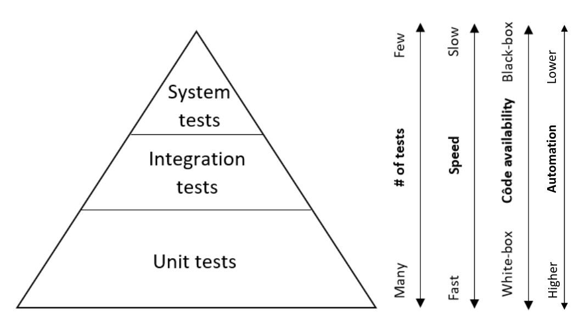

**Jedinično testiranje** je automatizirano testiranje svake jedinice koda unutar softvera. Za svaku klasu programske logike pišemo jednu _testnu_ klasu. Za svaku metodu klase programske logike kreiramo jednu ili više testnih metoda (_jediničnih testova_). Svaka testna metoda testira jedan scenarij poziva metode koju testiramo.
